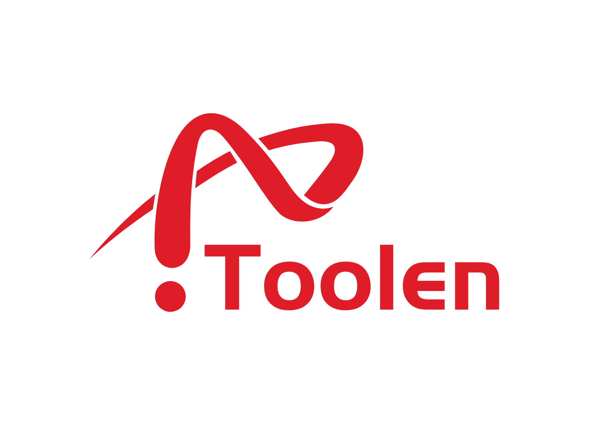

<div>
  
  <h1 align="center">Toolen</h1>
</div>

Toolen is a simple GNU/Linux core tool implementation. It includes some of the more standard core features and some "homebrew tools"

## Prepare environment
**On Ubuntu/Debian**
```bash
sudo apt update && sudo apt install gcc build-essential make
```
**On ArchLinx/Manjaro**
```bash
sudo pacman -Syy gcc build-essential make
```

**On Termux**
```bash
pkg update && pkg install clang build-essential make
```

Tips: If you are using windows, you could use Cygwin or WSL

## Build
```bash
git clone https://github.com/RoofAlan/Toolen
cd Toolen && make menuconfig # or 'make allyesconfig'
make -j$(nproc)
```

## Usage
```bash
./toolen [command|options] [args...]
```
or
```bash
ln -sf toolen CommandName
./CommandName
# For example:
#  ln -sf toolen echo
#  ./echo "Hello world!"
```

## TODO
- [ ] uname: Print userspace type
- [ ] reboot: Send SIGTERM & SIGKILL to all processes
- [ ] reboot: Force reboot
- [ ] Fix warnings at link-time
